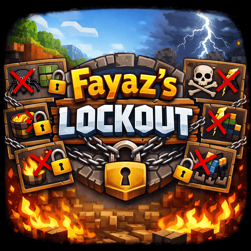

## Fayaz's Lockout
### Multiplayer - 2-100 Players

**Fayaz's Lockout** is a competitive lockout-style game mode with multiple play modes where players race to claim unique objectives before their opponents.

Set a goal (for example, 5) and race against other players to reach that number first. Once a specific objective is claimed by *any* player, **no one else can score points with that same objective again**.

---

## 🎯 Game Modes

### 💀 Death Mode
**Die in as many *unique* ways as possible before your opponents do.**

Deaths can be matched by two methods:
- **SOURCE**: Matches by damage type + entity type 
  - Burned to death while fighting Zombie is the same as burned to death.
- **MESSAGE**: Matches by death message text with player names removed 
  - Burned to death while fighting Zombie is DIFFERENT from burned to death.

Examples of unique deaths:
- Killed by Iron Golem
- Fell from a high place
- Burned to death
- Blown up by Creeper
- Drowned

### ⚔️ Kills Mode
**Kill as many *unique* mob types as possible before your opponents do.**

Each different mob type counts as one objective:
- Zombie, Creeper, Skeleton, Iron Golem, Warden, etc.

### 🛡️ Armor Mode
**Wear complete armor sets or individual pieces before your opponents do.**

Two submodes:
- **SET**: Claim a material by wearing a complete matching armor set (helmet, chestplate, leggings, boots)
- **PIECE**: Claim a material by wearing any single piece of that armor type

Available materials:
- Leather, Chainmail, Iron, Gold, Diamond, Netherite (6 total)

### 🏆 Advancements Mode
**Unlock unique advancements before your opponents do.**

Race to complete advancements like:
- Stone Age, Acquire Hardware, Diamonds!, We Need to Go Deeper, etc.
- 125 advancements available in vanilla Minecraft
- Recipe unlocks are excluded

### 🍖 Foods Mode
**Eat unique food types before your opponents do.**

Claim foods by consuming them:
- Apples, Bread, Cooked Beef, Golden Carrots, etc.
- 40+ food items in vanilla Minecraft
- Includes drinks like Milk and Honey

---

## 🎮 How It Works

- Each player earns **1 point per unique objective**
- An objective can only be scored **once per game**, globally
- The first player to reach the target goal **wins**
- Supports **2+ players** competing simultaneously. No limit.
- Each player has a **unique custom color** to track their progress on the HUD

---

## ▶️ Commands

### Setting up a game:

**1. Set the goal:**
```
/lockout goal <number>
```
Example: `/lockout goal 5`  
Default is 5. No upper limit.

**2. Choose the game mode:**
```
/lockout mode kills
/lockout mode armor set          (full matching sets required)
/lockout mode armor piece        (any single piece claims that material)
/lockout mode advancements
/lockout mode foods
/lockout mode death source       (matches by damage type)
/lockout mode death message      (matches by death message text)
```

**3. Add players:**
```
/lockout player add <player> [color]
```

**Color options:**
- **Named colors:** `red`, `orange`, `yellow`, `lime`, `green`, `cyan`, `blue`, `purple`, `magenta`, `pink`, `white`, `gray`, `black`
- **Hex codes:** `#FF5555`, `0xAABBCC`, or `FF5555`
- **Optional:** If no color is specified, a default color is assigned
- **Unique:** Each player must have a different color

Examples:
```
/lockout player add @p red
/lockout player add Fayaz
/lockout player add Kristaugh #00FF00
/lockout player add Dream 0xFFAA00
```

**4. (Optional) Set a custom spawn point:**
```
/lockout spawnpoint [x y z]
/lockout spawnpoint
```

- With coordinates: Sets spawn to those coordinates
- Without coordinates: Sets spawn to your current location
- If not set: Defaults to world spawn

**5. Start the game:**
```
/lockout start
```

When the game starts:
- All players are teleported to the spawn point
- Inventories are cleared
- Health and hunger are restored to full
- Players are frozen during a 3-second countdown (3, 2, 1, GO!)
- After countdown, players can move and the game begins

⚠️ Requires at least 2 players added and a goal set (> 0)

---

### Managing players:

**Modify a player's color:**
```
/lockout player modify <player> <color>
```

**Remove a player:**
```
/lockout player remove <player>
```

---

### During gameplay:

**Pause the game manually:**
```
/lockout pause
```

**Unpause the game:**
```
/lockout unpause
```

**Auto-pause on disconnect:**
- If a participating player disconnects, the game automatically pauses
- All remaining players are frozen
- A title message displays: "|| PAUSED - Waiting for [player] to reconnect"
- When the player reconnects, the game automatically resumes

**Stop the current match:**
```
/lockout stop
```
Ends the current match but keeps all configuration (goal, mode, players, spawn point)

**Reset everything:**
```
/lockout reset
```
Completely resets: stops the game and clears all configuration

**View current status:**
```
/lockout status
```
Shows:
- Active/paused status
- Current mode and submode
- Goal
- Player count
- Each player's score and color

---

## 🎮 Example Game Setups

### Death Mode:
```
/lockout goal 5
/lockout mode death source
/lockout spawnpoint
/lockout player add Player1 red
/lockout player add Player2 blue
/lockout start
```

### Kills Mode:
```
/lockout goal 10
/lockout mode kills
/lockout player add Steve
/lockout player add Alex
/lockout start
```

### Armor Mode (Set):
```
/lockout goal 3
/lockout mode armor set
/lockout player add Player1 red
/lockout player add Player2 blue
/lockout start
```

### Armor Mode (Piece):
```
/lockout goal 6
/lockout mode armor piece
/lockout player add Player1 red
/lockout player add Player2 blue
/lockout start
```

### Advancements Mode:
```
/lockout goal 15
/lockout mode advancements
/lockout player add Player1 red
/lockout player add Player2 blue
/lockout start
```

### Foods Mode:
```
/lockout goal 10
/lockout mode foods
/lockout player add Player1 red
/lockout player add Player2 blue
/lockout start
```

---

## 📊 HUD Display

During an active game, the HUD shows:
- **Goal and mode** at the top center
- Each player's **progress boxes** in their custom color
- **Player names** below their boxes
- **Icons** for each claimed objective:
  - Death mode: Shows the item/mob that killed them
  - Kills mode: Shows spawn eggs for killed mobs
  - Armor mode: Shows the chestplate of claimed armor types
  - Advancements mode: Shows related items (knowledge book default)
  - Foods mode: Shows the food item that was eaten

When paused, a large title appears in the center showing which player is being waited for.

---

## 📦 Installation

⚠️ **Required on both client and server**

All players must have the mod installed for Lockout to function correctly. The mod must be present on both the server and all clients.

---

## 🧠 Strategy Tips

### Death Mode:
- Think outside the box — environmental deaths matter
- Race to claim common deaths early (zombies, falling, fire)
- Force your opponents into risky situations 😈
- Creative death combinations can secure victory
- Use the SOURCE matching mode for more consistent death tracking

### Kills Mode:
- Plan efficient mob hunting routes
- Use spawn eggs or natural spawning strategically
- Consider biomes where rare mobs spawn
- Don't waste time on already-claimed mobs
- Check the HUD to see what's been claimed

### Armor Mode:
- **SET**: Focus on one material at a time - partial sets don't count
- **PIECE**: Rush cheap materials (leather, gold) for easy early points
- Mine strategically based on what materials are still available
- In SET mode, carry backup pieces in case one breaks
- In PIECE mode, wear your claimed armor to free inventory space

### Advancements Mode:
- Prioritize quick, easy advancements early (wood, stone tools)
- Plan advancement chains (some unlock others)
- Check the advancement tree to see what's possible
- Balance exploration vs progression advancements
- Remember recipe advancements don't count

### Foods Mode:
- Set up farms early for renewable food sources
- Fishing can provide multiple unique foods quickly
- Golden foods and suspicious stews count
- Raid villages for bread and other prepared foods
- Balance hunting, farming, and gathering

### General:
- Watch what objectives others have claimed on the HUD
- Communicate with teammates (or don't, if you're competing!)
- The pause system means you don't lose progress if someone disconnects
- Use the stop command to end a match early if needed
- Different modes reward different playstyles - choose based on your strengths

---

## 🎨 Features

- ✅ Five game modes (Death, Kills, Armor, Advancements, Foods)
- ✅ Configurable submodes for Death and Armor
- ✅ Custom spawn points
- ✅ 3-second countdown with player freeze
- ✅ Auto-pause on player disconnect
- ✅ Manual pause/unpause
- ✅ Unique color requirement per player
- ✅ Live HUD with progress tracking
- ✅ Mode-specific icon display for claimed objectives
- ✅ Separate stop vs reset commands
- ✅ Supports 2-100 players

Good luck, and may the best player win! 🏆
