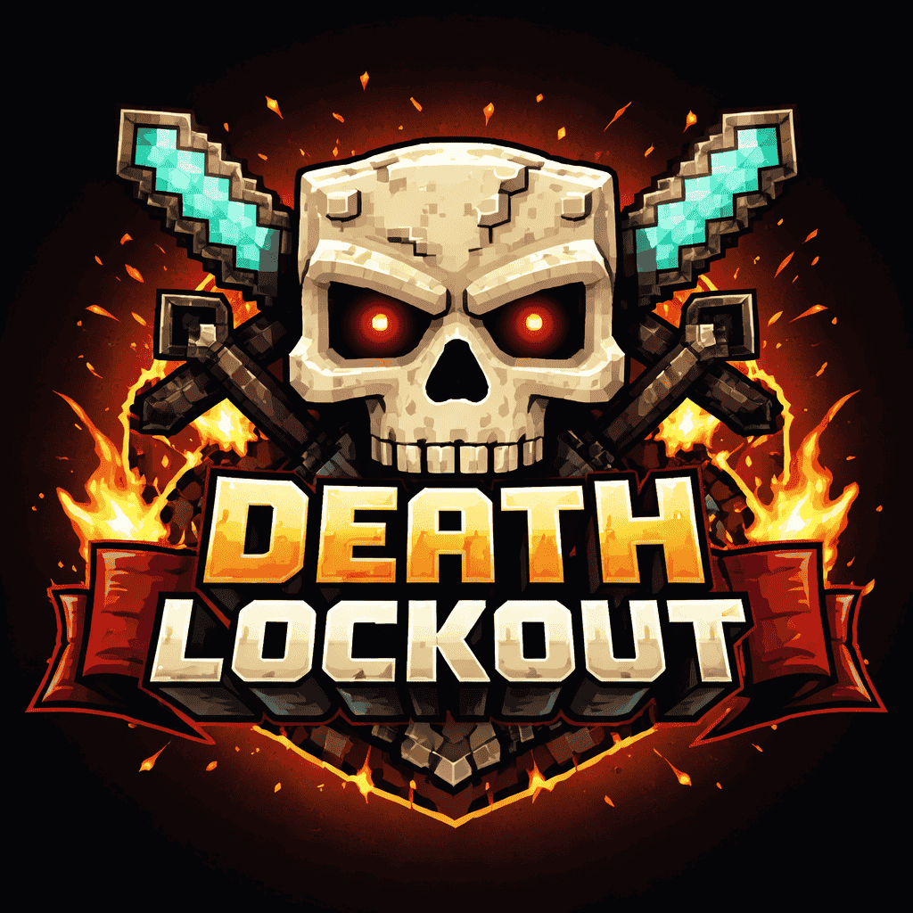

## 💀 Death Lockout

**Death Lockout** is a competitive lockout-style game mode where the objective is simple:  
**die in as many *unique* ways as possible before your opponents do.**

Set a death goal (for example, 5) and race against other players to reach that number first.  
Once a specific type of death is claimed by *any* player, **no one else can score points with that same death again**.

---

## 🎯 How It Works

- Each player earns **1 point per unique death**
- A death can only be scored **once per game**, globally
- The first player to reach the target number of unique deaths **wins**
- Supports **2+ players** competing simultaneously
- Each player has a **custom color** to track their progress on the HUD
- Creativity, risk-taking, and quick thinking are rewarded

---

## ☠️ What Counts as a "Unique" Death?

Deaths are categorized by their **death message**, with **player names ignored**.

For example, the following deaths are considered the **same** and only count once:
- `Fayaz was slain by Iron Golem`
- `Kristaugh was slain by Iron Golem`

However, these would be **different**:
- `was slain by Iron Golem`
- `was blown up by Creeper`
- `fell from a high place`
- `burned to death`

In short:
- Player names are removed
- If the remaining death message text is identical, it's the same death type

---

## ▶️ Commands

### Setting up a game:

**1. Set the goal:**
```
/lockout goal <number>
```
Example: `/lockout goal 5`

**2. Add players with colors:**
```
/lockout add <player> <color>
```

**Color options:**
- **Named colors:** `red`, `orange`, `yellow`, `lime`, `green`, `cyan`, `blue`, `purple`, `magenta`, `pink`, `white`, `gray`, `black`
- **Hex codes:** `#FF5555`, `0xAABBCC`, or `FF5555`

Examples:
```
/lockout add @p red
/lockout add Steve blue
/lockout add Alex #00FF00
/lockout add Notch 0xFFAA00
```

**3. Start the game:**
```
/lockout start
```
⚠️ Requires at least 2 players added and a goal set (> 0)

### Other commands:

**Reset / end the current game:**
```
/lockout reset
```

**View current status:**
```
/lockout status
```
Shows active status, goal, player count, and each player's score

---

## 🎮 Example Game Setup

```
/lockout goal 5
/lockout add Player1 red
/lockout add Player2 blue
/lockout add Player3 green
/lockout add Player4 yellow
/lockout start
```

Now all 4 players race to get 5 unique deaths first!

---

## 📊 HUD Display

During an active game, the HUD shows:
- **Goal number** at the top center
- Each player's **progress boxes** in their custom color
- **Player names** below their boxes
- **Death icons** for each claimed death (shows what killed them)

---

## 📦 Installation

⚠️ **Required on both client and server**

All players must have the mod installed for Death Lockout to function correctly. The mod must be present on both the server and all clients.

---

## 🧠 Tips

- Think outside the box — environmental deaths matter
- Race to claim common deaths early (zombies, falling, fire)
- Force your opponents into risky situations 😈
- Creative death combinations can secure victory
- Watch what deaths others have claimed on the HUD

Good luck, and happy dying! 💀
